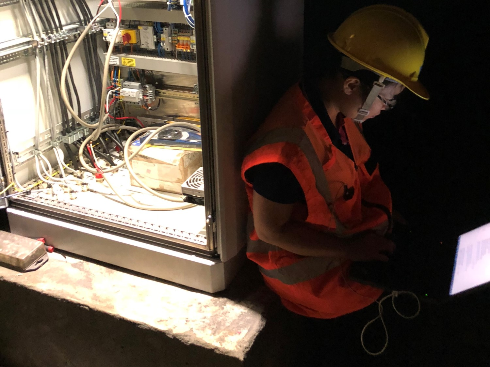
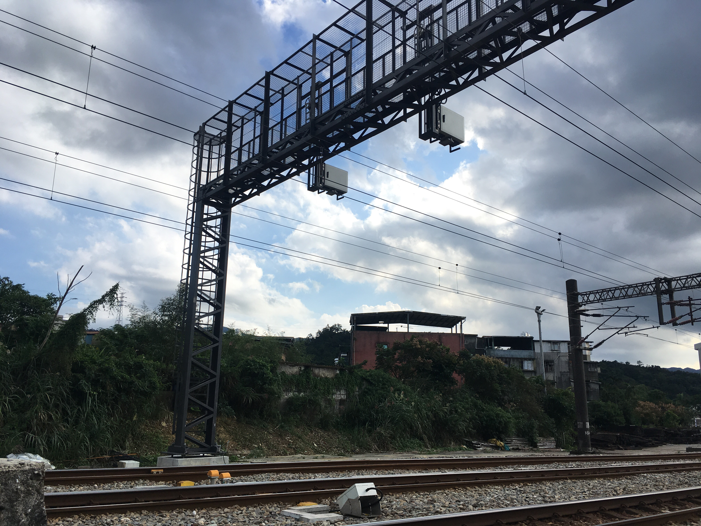
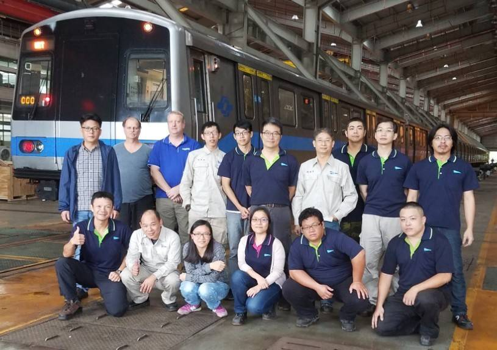

# Yiting Hsueh 

Railway engineer and team leader 

[Email](mailto:alice.yiting.hsueh@gmail.com) / [LinkedIn](https://www.linkedin.com/in/yiting-hsueh/) / [GitHub](https://github.com/YTHsueh) 

(Updating) 

## 🔩 Work Experience 

### 🚂 Welltek ITS, Field Application Engineer and Assistant Manager 
Oct 2013 - Present 

 
  
 
    Project manager of TRA's first wayside train monitoring system (hot axle box and pantograph) project 
  

  
 
    The project was awarded in 2018 and delivered in 2019. It is the first wayside train monitoring project. I had participated through the whole process from the concept development, specification discussion with the Entity, tender preparation, design and installation to warranty. 
    
    
  
 

  
 
    Project manager of delivering 87 water-proof switch machines to TRA 
  

  

    The project was awarded in 2018 and delivered in 2019. I had managed the contigency due to the supplier's production quality control and limited the delay to a month. 
    
    
  

  

    Installation team leader and lead commission engineer of Taipei Metro C301 propulsion upgrade phasee II project 
   

  

    The project was delivered a month ahead of schedule with the adjustment and improvement of the schedule and installation management. 
    
    
  

2013-2015, Engineer of Taiwan Railway Administration asset monitoring trail installation project 

2013-2015, Engineer of Taiwan Railway Administration's first level crossing 3D obstacle detection system trial installation and feasibility study project 

2013-2021, Various tender translation and technical proposal preparations 
  
### 🌞 Inventec Solar 
May 2011 - Aug 2012 
- Daily control and anaysis 10 lines' production process 
- Support double printing process reseach and development 

### 🌞 Eton Solar 
Nov 2010 - May 2011 
- Optimize diffusion process recipes with experiment design 
- Support selective emitter process research, development and evaluation 

## 🎓 Education 

### 👩‍💼 Erasmus Joint Master PIONEER Public Sector Innovation and E-Governance
2019 - Present 
KU Leuven, BE, University of Münster, DE, and TalTech, EST 
Thesis in progress: Innovation in European railway sectors 

### 🤖 National Tsing Hua University, Bachelor of Science, Material Science and Engineering 
2003 - 2007 
Taiwan 
